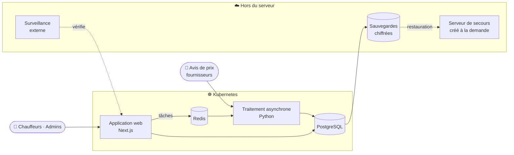

**Projet principal** — conçu, développé, déployé et exploité de bout en bout

**Plateforme de gestion pour le transport routier**
 
Prix du carburant en temps réel · Rapports de voyage et paie · Répertoire clients · États-Unis ↔ Canada

🌐 **[optifuel.cloud](https://optifuel.cloud)**

> **Code source privé.** Ce dépôt présente le projet : ce qu'il fait, son architecture et ses choix d'exploitation. Démonstration ou visite du code possible sur demande.

---

## ⚡ En bref

OptiFuel est une application web **en production**, utilisée au quotidien par les chauffeurs et l'administration d'un transporteur routier opérant entre le Québec et les États-Unis. Conçue, développée, déployée et exploitée de bout en bout par une seule personne.

| | |
|---|---|
| ⛽ **Prix du carburant** | États-Unis et Canada, par réseau, mis à jour automatiquement à partir des avis de prix des fournisseurs ; carte de chaleur, favoris |
| 🧭 **Itinéraire** | Trajet à plusieurs arrêts, stations disponibles le long du parcours, géolocalisation |
| 📄 **Rapport de voyage** | Manifeste scanné (PDF ou photo) lu automatiquement, paie calculée, PDF officiel envoyé depuis l'application |
| 👥 **Répertoire clients** | Collaboratif entre chauffeurs : notes, photos, évaluations, doublons détectés |
| 🏆 **Classement** | Chauffeur du mois, podium, chauffeur de l'année |
| 🛠️ **Backoffice** | Suivi des rapports, utilisateurs et rôles, signalements, statistiques d'utilisation |
| 📱 **Mobile** | Application installable (PWA), pensée pour la cabine du camion |

---

## 🏗️ Architecture

- **Application web** (Next.js, TypeScript) : interface chauffeur et backoffice, API, contrôle d'accès.
- **Service de traitement** (Python) : lecture de documents (manifestes, avis de prix), génération des PDF, calcul de paie — découplé du site par une file de tâches.
- **Tout ce qui doit survivre à une panne vit ailleurs** : sauvegardes, surveillance et serveur de secours sont hors du serveur de production.

---

## 📡 Fiabilité et exploitation

| | |
|---|---|
| 🔍 **Surveillance** | Vérification externe toutes les 2 minutes (site, traitement, fraîcheur des sauvegardes et des prix), alerte en ~4 min |
| 💾 **Sauvegardes** | Toutes les heures, hors serveur, rétention sur 3 ans ; restauration testée régulièrement |
| 🔁 **Reconstruction** | Production complète reconstruite sur un serveur neuf en ~3 min 30 |
| 🚑 **Reprise après sinistre** | Bascule vers un autre fournisseur, au Québec, en ~4 min — aucun serveur de secours payé en attente |
| 🔄 **Bascule planifiée** | Migration entre serveurs **sans perte de données**, page de maintenance, retour arrière automatique en cas d'échec |
| 🧪 **Exercices** | Chaque scénario se répète sur un environnement d'exercice, sans toucher la production |
| 🚀 **Déploiement** | CI/CD GitHub Actions, environnements dev et production séparés, images versionnées pour un retour arrière ciblé |

---

## 🛡️ Sécurité et conformité

- Contrôle d'accès par rôle, vérifié côté serveur sur chaque route
- Révocation de session immédiate (suspension ou suppression d'un compte)
- Secrets jamais en clair, copie de secours chiffrée
- Conteneurs sans privilèges administrateur
- **Loi 25 (Québec)** : politique de confidentialité, droit à la suppression de compte, rétention des données documentée
- Validation stricte des fichiers importés
- Journal d'audit des actions administratives

---

## 🧪 Qualité

Trois niveaux de tests automatisés, lancés en CI à chaque modification :

- **Unitaires** — logique métier (paie, prix, règles)
- **Intégration** — routes API contre de vraies bases jetables
- **Bout en bout** — parcours utilisateur dans un vrai navigateur (inscription, client, rapport de voyage)

---

## 🧱 Stack technique

| Couche | Technologies |
|---|---|
| Front-end | Next.js 16 (App Router), React 19, TypeScript, Tailwind CSS, Radix UI |
| Back-end | API Next.js, NextAuth, Prisma |
| Traitement | Python (lecture PDF/images, génération PDF) |
| Données | PostgreSQL, Redis |
| Cartographie | Google Maps Platform |
| Infrastructure | Kubernetes (k3s), Docker, GitHub Actions |
| Cloud | Cloudflare (Workers, R2), Resend, Sentry |
| Tests | Vitest, Playwright, Testcontainers, pytest |

---

**Développé par [Tranquility42](https://github.com/Tranquility42)**

